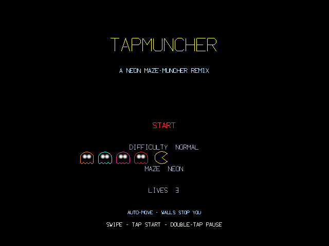
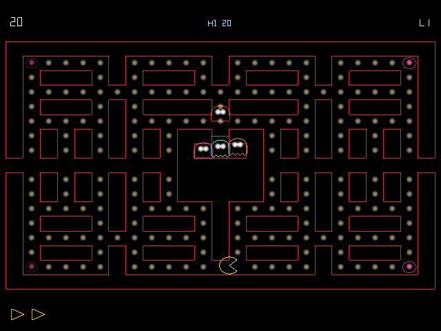

# TapMuncher

TapMuncher is a neon maze-muncher remix for the RayNeo X3 Pro AR glasses that preserves the classic formula — pellets, four power pills, four pursuers with distinct chase behaviors, scatter/chase wave timing, bonus fruit, and a wraparound tunnel — while rendering the whole maze as glowing vector lines on an open 3D table. The four pursuers each follow a faithful variant of the original ghost logic: one chases the player's tile directly, one aims ahead of the player's path, one mirrors the chaser's lunge, and one loses its nerve at close range. Mazes are hand-authored but self-healing at load time, using a flood-fill check that guarantees every pellet is reachable so a level can never soft-lock.

## Screenshots

  
  

## Controls

- Swipe in any of four directions to queue a turn, taken at the next opening
- Tap to select on menus
- Double-tap to pause

## Download

[TapMuncher.apk](TapMuncher.apk)
